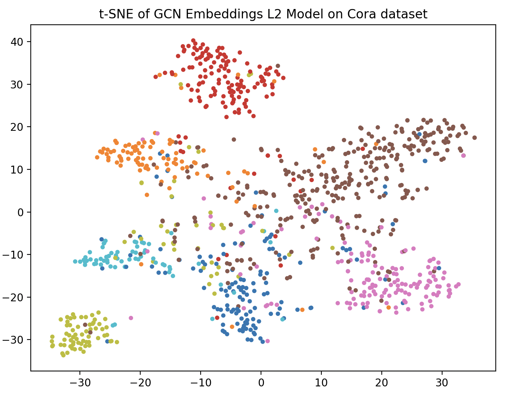
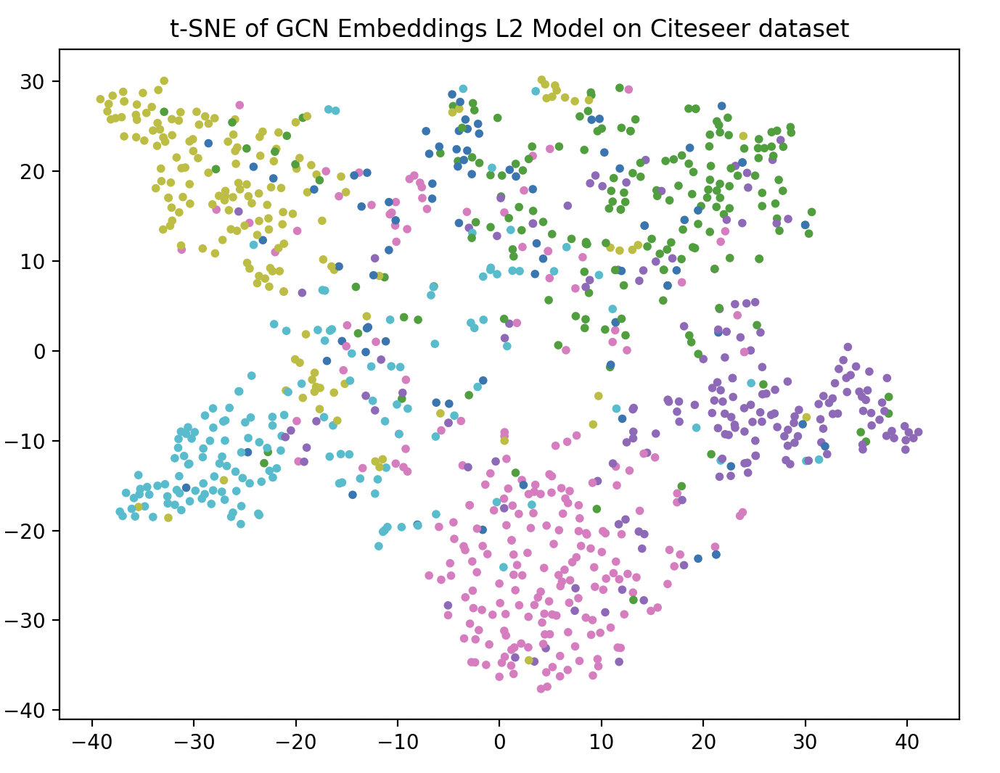
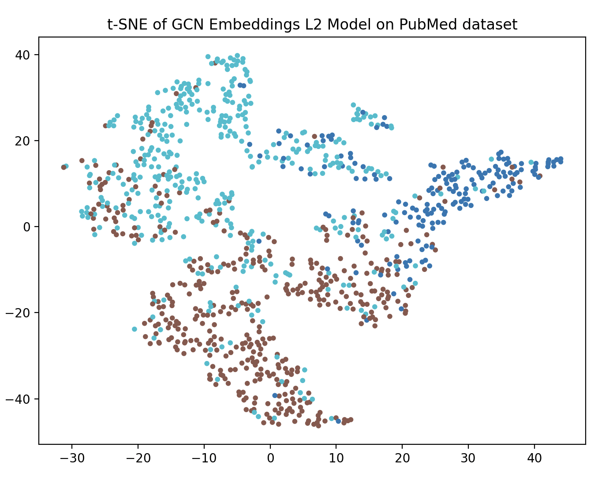

# Graph Convolutional Networks (GCNs) – Semi-Supervised Node Classification

This project implements the standard **Graph Convolutional Network (GCN)** based on the paper:

> *Semi-Supervised Classification with Graph Convolutional Networks* (Kipf & Welling, 2017)

The model is applied to the **Cora, Citeseer and PubMed citation network datasets** for node classification in a semi-supervised setting. 

## Background / Context
Convolutions are a simple yet powerful technique for efficiently processing structured data such as images. However, applying convolutions to graph-structured data is not straightforward. Unlike grids, graphs lack a fixed spatial structure, making it difficult to define consistent neighborhoods, traversal directions, and local receptive fields, all of which are essential for standard convolution operations.

To address this, earlier approaches relied on spectral graph theory, using eigenvalues, eigenvectors, and Fourier transforms. In this framework, graph convolution is defined as:


$$ g_\theta \star x = U g_\theta U^T x $$


where $x$ is the input signal, $U$ contains the eigenvectors of the normalized graph Laplacian $L$, and $g_\theta$ is a learnable filter in the Fourier domain. The operation $U^T x$ transforms the signal into the spectral domain, where it is filtered via element-wise multiplication with $g_\theta$, and then transformed back using $U$. While effective, this approach is computationally expensive, with complexity ranging from $O(N^2)$ to $O(N^3)$.

Thomas Kipf and Max Welling proposed a simplified formulation by approximating spectral convolutions using a first-order Chebyshev polynomial (i.e., $k = 1$ and $\lambda_{\text{max}} = 2$). This reduces the computational complexity to $O(|E|)$, making the method scalable to larger graphs.

Combined with the renormalization trick, this leads to the widely used propagation rule:

$$
H^{(l+1)} = \sigma\left( \tilde{D}^{-1/2} \tilde{A} \tilde{D}^{-1/2} H^{(l)} W^{(l)} \right)
= \sigma\left( \hat{A} H^{(l)} W^{(l)} \right)
$$

where $\tilde{A} = A + I$ adds self-loops, $\tilde{D}$ is the corresponding degree matrix, and $\hat{A}$ is the normalized adjacency matrix.

This normalization is crucial: it prevents feature magnitudes from growing uncontrollably and ensures that nodes with many neighbors do not dominate the aggregation process. The addition of self-loops allows each node to retain and propagate its own features alongside information from its neighbors.


## Project Overview

Graph Neural Networks (GNNs) extend deep learning to graph-structured data. In this project, I:

- Implement the basic structure of a GCN from scratch (no high-level wrappers)
- Perform semi-supervised node classification
- Use sparse adjacency matrix normalization
- Train and evaluate on the Cora, Citeseer and PubMed dataset
- Visualize learned node embeddings using **t-SNE**
- Experiment with effect of adding dropout and L2 regularization
- Training was performed for 500 epochs and each experiment was repeated 10 times to account for stochasticity in the analysis


## Model Architecture

The implemented GCN consists of:

- Two graph convolutional layers:
  - Input → Hidden layer (ReLU)
  - Hidden → Output layer (logits)
- Dropout regularization
- Symmetric normalized adjacency matrix:


$$ \hat{A} = D^{-1/2}(A + I)D^{-1/2} $$
- Propagation rule mentioned above


## Datasets

- **Cora, Citeseer and PubMed citation networks**
- Nodes: scientific publications
- Edges: citation links
- Task: classify each node into one of research paper classes
- Semi-supervised:
  - Only a small subset of nodes is labeled for training
  - Evaluation is done on a test mask

| Dataset   | Type              | Nodes  | Edges  | Classes | Features | Label Rate |
|----------|-------------------|--------|--------|---------|----------|------------|
| Citeseer | Citation network  | 3,327  | 4,732  | 6       | 3,703    | 0.036      |
| Cora     | Citation network  | 2,708  | 5,429  | 7       | 1,433    | 0.052      |
| Pubmed   | Citation network  | 19,717 | 44,338 | 3       | 500      | 0.003      |


## Embedding Visualization

We use **t-SNE** to project learned node embeddings into 2D space:

- Visualizes clustering behavior of the GCN
- Helps assess hidden representation quality
- Applied to test nodes after training of a GCN

## Results
To asses performance, below are the results from training and testing averaged over 10 independent runs to account for variability in intialization. We can see that for all three datasets the L2 model performs slightly better compared to the other model, reaching a testing accuracy of **0.8076 ± 0.0027 on Cora**,  **0.6810 ± 0.0044 on Citeseer** and  **0.7933 ± 0.0016 on PubMed**.

### Cora

| Model    | Train Loss           | Val Acc              | Test Acc             |
|----------|---------------------|----------------------|----------------------|
| Baseline | 0.0005 ± 0.0000     | 0.7674 ± 0.0083      | 0.7800 ± 0.0042      |
| L2       | 0.0148 ± 0.0003     | 0.7770 ± 0.0061      | 0.8076 ± 0.0027      |
| Dropout  | 0.0031 ± 0.0011     | 0.7674 ± 0.0092      | 0.7810 ± 0.0041      |
| Full     | 0.0217 ± 0.0031     | 0.7742 ± 0.0076      | 0.8074 ± 0.0046      |


### Citeseer

| Model    | Train Loss           | Val Acc              | Test Acc             |
|----------|---------------------|----------------------|----------------------|
| Baseline | 0.0007 ± 0.0001     | 0.6252 ± 0.0133      | 0.6287 ± 0.0122      |
| L2       | 0.0146 ± 0.0006     | 0.6828 ± 0.0043      | 0.6810 ± 0.0044      |
| Dropout  | 0.0163 ± 0.0070     | 0.6304 ± 0.0188      | 0.6411 ± 0.0250      |
| Full     | 0.0444 ± 0.0069     | 0.6834 ± 0.0080      | 0.6796 ± 0.0035      |


### Pubmed

| Model    | Train Loss           | Val Acc              | Test Acc             |
|----------|---------------------|----------------------|----------------------|
| Baseline | 0.0044 ± 0.0003     | 0.7592 ± 0.0024      | 0.7576 ± 0.0021      |
| L2       | 0.0494 ± 0.0010     | 0.7838 ± 0.0027      | 0.7933 ± 0.0016      |
| Dropout  | 0.0109 ± 0.0022     | 0.7682 ± 0.0055      | 0.7608 ± 0.0036      |
| Full     | 0.0656 ± 0.0069     | 0.7868 ± 0.0035      | 0.7911 ± 0.0031      |


## t-SNE Embedding Visualizations
Below are the t-SNE Embedding Visualizations of the test nodes for the trained L2 (best performing) model on all three datasets. We observe that (especially for Cora and Citeseer) the class separation of nodes in the final hidden layer is good, with only minor overlap between classes, indicating that the model has enough power to generate accuracte hidden representations for each nodes of each class in the embedding space.

<table align="center">
  <tr>
    <td align="center">
      <br>
    </td>
    <td align="center">
      <br>
    </td>
        <td align="center">
      <br>
    </td>
  </tr>
</table>

## Conclusions
- Kipf and Welling GCN architecture works well for semi-supervised node classification.
- The embeddings learn meaningfull representations of the node features, which cluster well according to their classification label.
- Future work could try to build more powerful architectures (deeper models and larger hidden layer size) to further increase train & testing accuracy.

## Repository Structure
```
project-root/
├── config/  
      ├── Citeseer_config.yaml                        # Citeseer default config file
      ├── Cora_config.yaml                            # Cora default config file
      ├── PubMed_config.yaml                          # Pubmed default config file              
├── data/Planetoid/
          ├── Citeseer/                               # Citseer raw and processed data
          ├── Cora/                                   # Citseer raw and processed data
          ├── PubMed/                                 # Citseer raw and processed data           
├── figures/                                          # figures from t-SNE embedding visualizations
├── src/     
      ├── models/
            ├── GCN_layer.py                          # Single GCN layer implementation
            ├── GCN.py                                # Full GCN structure implementation
      ├── utils/
            ├── embeddings_visuals.py                 # Embedding visualizations
            ├── graph_utils.py                        # Normalize Adjacency matrix
            ├── plotting.py                           # Plot training and test statistics
      ├── experiment_tsne.py                          # Experiment for t-SNE embedding visualizations
      ├── experiments.py                              # Running the four experiments
      ├── test.py                                     # Training loop
      ├── training.py                                 # Final testing
├── .gitignore                                        # Main file to run all experiments + embedding visualizations 
├── main.py                                           # Install all required packages and libraries
├── requirements.txt                                  
└── README.md
```

## Installation

### 1. Clone the repository

```bash
git clone https://github.com/kierancarroll/Graph-Convolutional-Network.git
cd Graph-Convolutional-Network
```

### 2. Create virtual environment

```bash
python3 -m venv venv
source venv/bin/activate
```

### 3. Install dependencies
```bash
pip install -r requirements.txt
```

## Usage

Run the full pipeline:

```bash
python main.py --dataset {DATASET_NAME}
```

This will:
- Load the dataset  
- Train the GCN  
- Evaluate on the test set  
- Plot training statistics
- Generate t-SNE visualization of the best model


## Configuration
Hyperparameters are stored in:

```bash
src/{DATASET_NAME}_config.yaml
```

Default:

```python
training:
  n_runs: 10
  epochs: 100
  lr: 0.01

model:
  hidden_dim: 16
  dropout: 0.5
```


## References
- Kipf, T. N., & Welling, M. (2017).  
  *Semi-Supervised Classification with Graph Convolutional Networks*. arXiv preprint arXiv:1609.02907.
- [Pytorch Geometric Documentation](https://pytorch-geometric.readthedocs.io/en/latest/)


